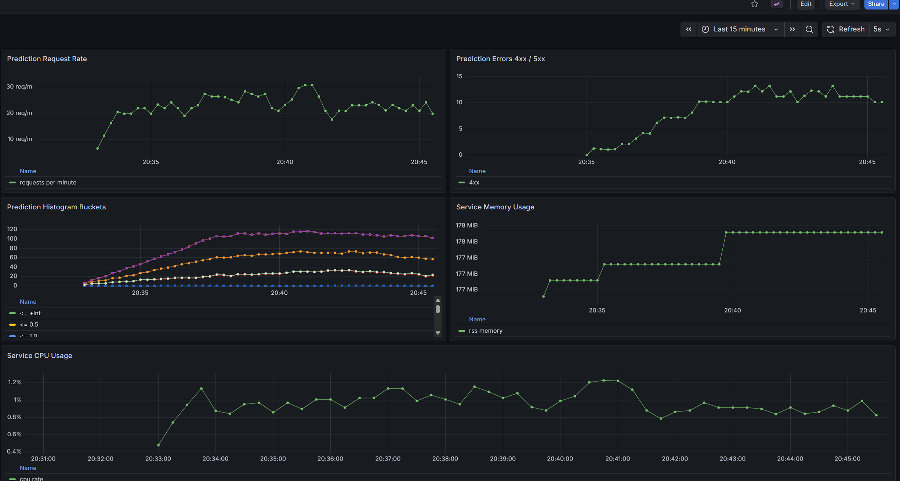

# ЛР1-ЛР4. ML-проект по предсказанию цены автомобиля

## Описание проекта

Проект посвящен задаче регрессии: по характеристикам автомобиля нужно предсказать цену продажи `Selling_Price`.

За время работы над проектом были реализованы:

- разведочный анализ данных и очистка датасета;
- построение baseline-модели и нескольких улучшенных версий;
- логирование экспериментов и регистрация моделей в MLflow;
- подготовка Production-модели;
- разработка FastAPI-сервиса предсказаний;
- контейнеризация сервиса через Docker;
- генератор запросов для нагрузки на сервис;
- мониторинг сервиса через Prometheus;
- дашборд в Grafana для прикладного, инфраструктурного и модельного мониторинга.

## Технологии и библиотеки

В проекте использовались:

- Python 3.11/3.14
- pandas, numpy, seaborn, matplotlib, plotly
- scikit-learn, mlxtend, optuna
- Jupyter Notebook
- MLflow
- FastAPI, uvicorn
- Docker, Docker Compose
- Prometheus, Grafana
- PromQL

Этот стек покрывает полный цикл работы с ML-проектом: от анализа данных и обучения модели до упаковки, деплоя и мониторинга сервиса.

## Запуск

Ниже приведены команды для Windows PowerShell.

### 1. Клонирование репозитория

```powershell
git clone https://github.com/sexer7/lab_iis.git
cd lab_iis
```

### 2. Создание и активация виртуального окружения

```powershell
python -m venv .venv
.\.venv\Scripts\Activate.ps1
```

### 3. Установка зависимостей

```powershell
python -m pip install --upgrade pip
python -m pip install -r requirements.txt
```

### 4. Подключение окружения как Jupyter kernel

```powershell
python -m ipykernel install --user --name lab_iis --display-name "lab_iis (.venv)"
```

### 5. Запуск ноутбуков проекта

```powershell
code .
```

После открытия проекта в VS Code:

1. Для ЛР1 откройте `eda/eda.ipynb`.
2. Для ЛР2 откройте `research/research.ipynb`.
3. Выберите kernel `lab_iis (.venv)`.
4. Запускайте ячейки по порядку.

### 6. Запуск MLflow

Скрипт запуска находится в `mlflow/start_mlflow.sh`.

Команда для Git Bash:

```bash
cd mlflow
sh start_mlflow.sh
```

Эквивалентная команда для PowerShell:

```powershell
cd mlflow
python -m mlflow server --backend-store-uri sqlite:///mlflow.db --default-artifact-root ./artifacts --host 127.0.0.1 --port 5000 --workers 1
```

Веб-интерфейс MLflow:

- `http://127.0.0.1:5000`
- `http://localhost:5000`

### 7. Подготовка модели для сервиса

Перед запуском сервиса нужно выгрузить Production-модель из MLflow:

```powershell
python services/models/get_model.py
```

После этого в `services/models` должен появиться файл `model.pkl`.

### 8. Локальный запуск сервиса предсказаний

```powershell
python -m uvicorn services.ml_service.main:app --host 127.0.0.1 --port 8000 --reload
```

Swagger UI:

- `http://127.0.0.1:8000/docs`
- `http://localhost:8000/docs`

### 9. Сборка и запуск Docker Compose-проекта

Файл оркестрации находится в `services/compose.yml`.

Сборка:

```powershell
cd services
docker compose -f compose.yml build
```

Запуск:

```powershell
docker compose -f compose.yml up
```

Запуск в фоне:

```powershell
docker compose -f compose.yml up -d
```

Остановка:

```powershell
docker compose -f compose.yml down
```

После запуска будут доступны:

- ML-сервис: `http://localhost:8000/docs`
- Prometheus: `http://localhost:9090`
- Grafana: `http://localhost:3000`

Для Grafana используются учетные данные:

- логин: `admin`
- пароль: `admin`

## Структура проекта

- `data/car_data.csv` - исходный датасет.
- `data/car_data_cleaned.csv` - очищенный датасет после EDA.
- `data/car_data_cleaned.pkl` - очищенный датасет в формате pickle.
- `eda/eda.ipynb` - ноутбук с разведочным анализом данных.
- `research/research.ipynb` - основной ноутбук с исследованиями и экспериментами ЛР2.
- `research/common.py` - общие функции для пайплайнов, метрик и служебных операций.
- `research/train_baseline.py` - baseline-модель.
- `research/train_featured_model.py` - модель с новыми признаками из `sklearn`.
- `research/train_selected_model.py` - модель с `mlxtend.SequentialFeatureSelector`.
- `research/train_tuned_model.py` - тюнинг гиперпараметров через `Optuna`.
- `research/train_production_model.py` - обучение Production-модели на всей выборке.
- `mlflow/start_mlflow.sh` - запуск локального MLflow server.
- `services/compose.yml` - сборка и запуск сервисов проекта через Docker Compose.

## Сервис предсказания

Сервис предсказаний развёрнут на `FastAPI` и принимает признаки автомобиля в теле запроса, после чего возвращает предсказанную цену продажи.

Содержимое `services/ml_service`:

- `main.py` - основной модуль FastAPI с endpoint-ами `/`, `/health`, `/metrics/` и `/api/prediction/{item_id}`.
- `api_handler.py` - класс `FastAPIHandler`, который загружает модель и делает предсказание.
- `common.py` - вспомогательный класс `FeatureIndexSelector`, необходимый для корректной загрузки сериализованной модели.
- `requirements.txt` - минимальные зависимости для контейнера сервиса.
- `Dockerfile` - описание контейнера для сервиса предсказаний.

Содержимое `services/models`:

- `get_model.py` - скрипт выгрузки Production-модели из MLflow по `run_id`.
- `model.pkl` - локально сохранённая модель, которая монтируется в контейнер в volume `/models`.

Сервис использует Production-модель из MLflow с `run_id = 6e05235bc5aa464db3d168d2249fbb42`.

## Сервис генерации запросов

Сервис `requests` нужен для генерации нагрузки на ML-сервис и "оживления" мониторинга.

Содержимое `services/requests`:

- `requests.py` - бесконечный цикл отправки запросов в ML-сервис через случайные промежутки времени от `0` до `5` секунд.
- `requirements.txt` - минимальный набор зависимостей для контейнера сервиса запросов.
- `Dockerfile` - описание контейнера для генератора запросов.

По умолчанию сервис обращается к адресу `http://ml_service:8000`, что соответствует имени сервиса внутри `docker compose`.

Часть запросов специально отправляется с ошибкой, чтобы в мониторинге появлялись метрики `4xx`.

## Сервис Prometheus

Prometheus отвечает за сбор и хранение метрик с ML-сервиса.

Содержимое `services/prometheus`:

- `prometheus.yml` - конфигурация scrape-задач.
- `data/` - runtime-данные Prometheus.
- `screenshots/` - сохранённые скриншоты из раздела мониторинга.

Веб-интерфейс Prometheus:

- `http://localhost:9090`

С Prometheus собираются:

- гистограмма значений предсказаний модели;
- частота запросов к endpoint предсказаний;
- количество запросов с кодами `4xx` и `5xx`;
- инфраструктурные метрики процесса сервиса, например CPU и память.

## Сервис Grafana

Grafana отвечает за визуализацию метрик и дашборды.

Содержимое `services/grafana`:

- `dashboards/ml-service-monitoring.json` - экспортированный dashboard.
- `provisioning/datasources/datasource.yml` - автоматическое подключение Prometheus как datasource.
- `provisioning/dashboards/dashboard.yml` - автоматическая загрузка dashboard из файловой системы.
- `screenshots/dashboard.png` - скриншот итогового дашборда.
- `data/` - runtime-данные Grafana.

Веб-интерфейс Grafana:

- `http://localhost:3000`

После запуска compose-проекта Grafana автоматически подхватывает datasource `Prometheus` и dashboard `ML Service Monitoring`.

## Проверка работоспособности сервиса

Откройте `http://localhost:8000/docs`, выберите endpoint `POST /api/prediction/{item_id}` и выполните тестовый запрос.

Пример `item_id`:

```text
123
```

Пример тела запроса:

```json
{
  "Car_Name": "ritz",
  "Year": 2014,
  "Present_Price": 5.59,
  "Driven_kms": 27000,
  "Fuel_Type": "Petrol",
  "Selling_type": "Dealer",
  "Transmission": "Manual",
  "Owner": 0
}
```

Пример ответа:

```json
{
  "item_id": 123,
  "predict": 3.6582407176157177
}
```

## Мониторинг

### Гистограмма предсказаний модели


Этот график построен по histogram-метрике `car_price_prediction_value_bucket` и показывает распределение предсказаний модели по корзинам. Это уровень мониторинга качества модели: по нему можно увидеть, в каком диапазоне цен сервис чаще всего выдаёт предсказания.

### Частота запросов к основному сервису в минуту

Этот график показывает интенсивность обращений к endpoint предсказаний. Он относится к прикладному уровню мониторинга и помогает понять, насколько активно используется сервис.

### Количество запросов с кодами ошибок 4xx и 5xx

Этот график показывает число ошибочных запросов. Метрики `4xx` отражают ошибки клиента, а `5xx` — ошибки сервера. Это прикладной уровень мониторинга, связанный со стабильностью API.

## Дашборд Grafana



На итоговом дашборде собраны пять графиков разных уровней мониторинга:

1. `Prediction Request Rate`
   Показывает количество запросов к сервису предсказаний в минуту.
   Уровень мониторинга: прикладной.

2. `Prediction Errors 4xx / 5xx`
   Показывает количество ошибочных запросов по двум классам статусов.
   Уровень мониторинга: прикладной.

3. `Prediction Histogram Buckets`
   Показывает распределение предсказаний модели по histogram-корзинам.
   Уровень мониторинга: качество работы модели.

4. `Service Memory Usage`
   Показывает использование оперативной памяти процессом сервиса.
   Уровень мониторинга: инфраструктурный.

5. `Service CPU Usage`
   Показывает загрузку CPU процессом сервиса.
   Уровень мониторинга: инфраструктурный.

Для "оживления" дашборда используется сервис `request_service`, который генерирует как корректные, так и ошибочные запросы к ML-сервису.

## Результаты исследования

### Baseline

- модель: `StandardScaler + OrdinalEncoder + RandomForestRegressor`
- метрики: `MAE = 1.0808`, `MAPE = 0.3060`, `MSE = 7.2714`

### Модель с новыми признаками

- добавлены `PolynomialFeatures` и `KBinsDiscretizer`
- метрики: `MAE = 1.0590`, `MAPE = 0.3060`, `MSE = 6.8207`

### Лучшая модель по качеству

Лучший результат по целевой метрике `MAE` показал run `6d6108e1e17f425cb06afab37d7c53e0`.

Характеристики лучшей модели:

- модель: `RandomForestRegressor`
- параметры: `n_estimators = 200`, `max_depth = 12`, `min_samples_leaf = 2`
- preprocessing: `PolynomialFeatures + KBinsDiscretizer + OrdinalEncoder`
- отбор признаков: `mlxtend.SequentialFeatureSelector`
- метрики: `MAE = 1.0393`, `MAPE = 0.3062`, `MSE = 6.2757`

Выбранные столбцы:

- `num_scaled__Year`
- `num_poly__Year^2`
- `num_poly__Year Present_Price`
- `num_bins__Year_0.0`
- `num_bins__Year_1.0`
- `num_bins__Year_2.0`
- `num_bins__Year_3.0`
- `num_bins__Driven_kms_3.0`
- `cat__Car_Name`
- `cat__Fuel_Type`

### Production-модель

Лучшая модель была переобучена на всей очищенной выборке и зарегистрирована как Production-версия.

- production run_id: `6e05235bc5aa464db3d168d2249fbb42`
- зарегистрированная модель: `car-price-rf-featured-sfs`
- версия в реестре: `3`
- тег версии: `status = Production`
- alias модели: `Production`

## Что важно поддерживать актуальным

- При добавлении новых библиотек необходимо обновлять `requirements.txt`.
- После изменения структуры проекта нужно актуализировать разделы `Запуск`, `Структура проекта`, `Мониторинг` и `Дашборд`.
- README должен соответствовать текущему состоянию проекта на каждом коммите.
